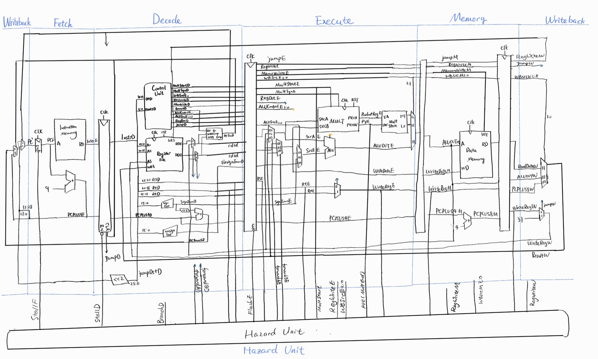

# PipelinedMIPS

alu.v - ALU

multiplier.v - Unsigned multiplier that needs to be wired to external ALU to function
TODO: Signed multiplier

{fetch, decode, execute, memory, writeback}.v - stages of pipeline
